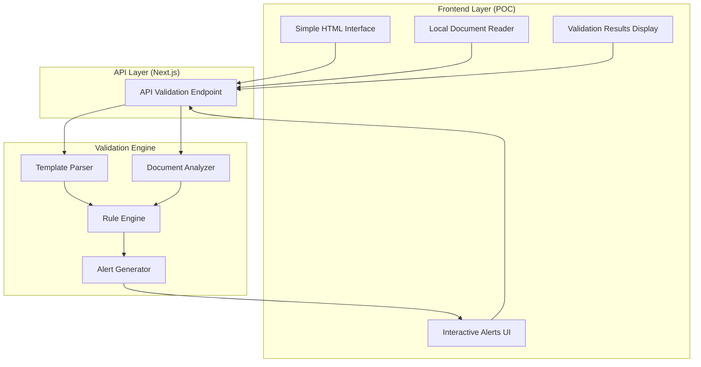

# Design Document: Gap Analysis Completeness Check

## Overview

The Gap Analysis Completeness Check is a simplified proof-of-concept feature that validates local documents against Excel or JSON templates. This solution uses a simple HTML frontend with a Next.js API backend validation engine. The system reads local documents, validates them against template requirements, and provides interactive feedback through alerts - no database or file upload complexity.

The design focuses on core validation functionality with minimal infrastructure requirements for rapid prototyping and concept validation.

## Architecture

### High-Level Architecture



### Technology Integration

This simplified design focuses on core validation functionality:
- **Frontend**: Simple HTML/CSS/JavaScript (no React complexity)
- **Backend**: Single Next.js API route for validation
- **Document Processing**: Local file reading with existing libraries (pdf-lib, mammoth)
- **Template Parsing**: Excel/JSON parsing without database storage
- **No Database**: All processing in-memory for POC simplicity

## Components and Interfaces

### 1. Template Parser

**Purpose**: Parses Excel and JSON templates to extract validation rules (in-memory processing)

**Key Methods**:
```typescript
interface TemplateParser {
  parseExcelTemplate(fileContent: Buffer): ValidationRuleSet
  parseJsonTemplate(fileContent: string): ValidationRuleSet
  extractValidationRules(template: any): ValidationRule[]
}
```

**Responsibilities**:
- Parse Excel files using existing document processing libraries
- Parse JSON template files with structured validation rules
- Extract validation criteria and requirements (no validation of template itself)

### 2. Document Analyzer

**Purpose**: Analyzes local documents against template requirements

**Key Methods**:
```typescript
interface DocumentAnalyzer {
  analyzeLocalDocument(fileContent: Buffer, template: ValidationRuleSet): AnalysisResult
  checkContentPresence(document: any, rules: ValidationRule[]): ContentCheck[]
  validateFormatRequirements(document: any, rules: ValidationRule[]): FormatCheck[]
  generateGapReport(checks: ValidationCheck[]): GapReport
}
```

**Responsibilities**:
- Process local documents using existing parsing libraries
- Check content presence against template requirements
- Validate document format requirements
- Generate detailed gap analysis reports (in-memory)

### 3. Rule Engine

**Purpose**: Executes validation rules against document content (stateless processing)

**Key Methods**:
```typescript
interface RuleEngine {
  executeRule(rule: ValidationRule, document: any): RuleResult
  evaluateConditions(conditions: RuleCondition[], content: any): boolean
  calculateCompleteness(results: RuleResult[]): CompletenessScore
  prioritizeIssues(results: RuleResult[]): PrioritizedIssue[]
}
```

**Responsibilities**:
- Execute individual validation rules
- Evaluate rule conditions against document content
- Calculate overall completeness scores
- Prioritize issues by severity and impact

### 4. Alert Generator

**Purpose**: Creates interactive alerts and remediation suggestions (client-side display)

**Key Methods**:
```typescript
interface AlertGenerator {
  generateAlerts(gaps: ValidationGap[]): InteractiveAlert[]
  createRemediationSteps(gap: ValidationGap): RemediationStep[]
  formatAlertMessage(alert: InteractiveAlert): AlertMessage
  createInteractiveElements(alerts: InteractiveAlert[]): HTMLElement[]
}
```

**Responsibilities**:
- Generate user-friendly alert messages
- Create actionable remediation steps
- Format alerts for HTML display
- Create interactive DOM elements for alerts

### 5. In-Editor Validation Manager

**Purpose**: Integrates validation feedback directly into the editor with real-time indicators

**Implementation Approach**:
- **Phase 1 (Task 6)**: HTML-based demo using contenteditable
- **Phase 2 (Task 9)**: Tiptap integration with ProseMirror decorations

**Key Methods**:
```typescript
interface InEditorValidationManager {
  attachToEditor(editor: HTMLElement | Editor, validationResults: AnalysisResult): void
  createInlineIndicators(gaps: ValidationGap[]): HTMLElement[] | EditorDecoration[]
  showPlaceholderHints(missingContent: ValidationGap[]): void
  highlightProblematicContent(formatErrors: ValidationGap[]): void
  renderOutlineView(template: ValidationRuleSet, document: any): OutlineViewData
  updateValidationStatus(gapId: string, status: 'fixed' | 'acknowledged' | 'dismissed'): void
  detachFromEditor(): void
}
```

**Responsibilities**:
- Attach validation indicators to editor (HTML spans or Tiptap decorations)
- Create inline validation indicators with severity-based styling
- Display placeholder hints for missing content
- Highlight problematic text for format errors
- Render structured outline view for blank documents
- Track and update validation status in real-time
- Handle user interactions with validation indicators

### 6. Validation Decorator

**Purpose**: Creates editor decorations/indicators for validation feedback

**Implementation Approach**:
- **Phase 1**: HTML spans with CSS styling
- **Phase 2**: Tiptap ProseMirror decorations

**Key Methods**:
```typescript
interface ValidationDecorator {
  createMissingContentIndicator(gap: ValidationGap, position: number): HTMLElement | Decoration
  createFormatErrorIndicator(gap: ValidationGap, range: { from: number; to: number }): HTMLElement | Decoration
  createPlaceholderIndicator(gap: ValidationGap, position: number): HTMLElement | Decoration
  getSeverityStyle(severity: 'critical' | 'warning' | 'info'): DecorationStyle
  createTooltipWidget(gap: ValidationGap): HTMLElement
}
```

**Responsibilities**:
- Create editor indicators for different validation types
- Apply severity-based styling (critical: red, warning: yellow, info: blue)
- Generate tooltip widgets with gap details and remediation steps
- Position indicators at appropriate document locations
- Handle indicator lifecycle and updates

## Data Models

### ValidationRuleSet

```typescript
interface ValidationRuleSet {
  name: string
  templateType: 'excel' | 'json'
  rules: ValidationRule[]
}

interface ValidationRule {
  name: string
  description: string
  type: 'content_presence' | 'format_requirement'
  field: string
  required: boolean
  severity: 'critical' | 'warning' | 'info'
  remediationHint: string
}
```

### AnalysisResult

```typescript
interface AnalysisResult {
  documentName: string
  templateName: string
  completenessPercentage: number
  gaps: ValidationGap[]
  alerts: InteractiveAlert[]
  analysisDate: Date
  processingTime: number
}
}

interface ValidationGap {
  ruleId: string
  severity: 'critical' | 'warning' | 'info'
  category: 'missing_content' | 'format_error'
  description: string
  remediationSteps: string[]
  required: boolean
}

interface InteractiveAlert {
  gapId: string
  title: string
  message: string
  remediationSteps: string[]
  status: 'open' | 'acknowledged' | 'resolved'
  acknowledgedAt?: Date
  resolvedAt?: Date
}
```

### In-Editor Validation Models

```typescript
interface EditorDecoration {
  id: string
  gapId: string
  type: 'missing_content' | 'format_error' | 'placeholder_hint'
  severity: 'critical' | 'warning' | 'info'
  position: number | { from: number; to: number }
  tooltip: TooltipContent
  status: 'active' | 'acknowledged' | 'dismissed' | 'fixed'
}

interface TooltipContent {
  title: string
  description: string
  remediationSteps: string[]
  actions: TooltipAction[]
}

interface TooltipAction {
  label: string
  action: 'acknowledge' | 'dismiss' | 'fix' | 'view_details'
  callback: () => void
}

interface OutlineViewData {
  sections: OutlineSection[]
  completenessPercentage: number
  totalRequired: number
  totalCompleted: number
}

interface OutlineSection {
  id: string
  title: string
  required: boolean
  status: 'complete' | 'incomplete' | 'partial'
  severity: 'critical' | 'warning' | 'info'
  subsections: OutlineSection[]
  validationGaps: ValidationGap[]
  position?: number // Position in document if exists
}

interface DecorationStyle {
  backgroundColor?: string
  borderColor?: string
  borderStyle?: string
  borderWidth?: string
  textDecoration?: string
  opacity?: number
  icon?: string
  iconColor?: string
}
```

### Validation Indicator Styling

```typescript
const SEVERITY_STYLES = {
  critical: {
    backgroundColor: 'rgba(239, 68, 68, 0.1)', // red-500 with opacity
    borderColor: '#ef4444',
    borderStyle: 'solid',
    borderWidth: '0 0 2px 0',
    icon: '🔴',
    iconColor: '#ef4444'
  },
  warning: {
    backgroundColor: 'rgba(245, 158, 11, 0.1)', // amber-500 with opacity
    borderColor: '#f59e0b',
    borderStyle: 'dashed',
    borderWidth: '0 0 2px 0',
    icon: '⚠️',
    iconColor: '#f59e0b'
  },
  info: {
    backgroundColor: 'rgba(59, 130, 246, 0.1)', // blue-500 with opacity
    borderColor: '#3b82f6',
    borderStyle: 'dotted',
    borderWidth: '0 0 1px 0',
    icon: 'ℹ️',
    iconColor: '#3b82f6'
  }
}

const PLACEHOLDER_STYLE = {
  backgroundColor: 'rgba(156, 163, 175, 0.05)', // gray-400 with low opacity
  borderColor: '#9ca3af',
  borderStyle: 'dashed',
  borderWidth: '1px',
  opacity: 0.6,
  icon: '➕',
  iconColor: '#9ca3af'
}
```

Now I need to use the prework tool to analyze the acceptance criteria before writing the correctness properties.

<function_calls>
<invoke name="prework">
<parameter name="featureName">gap-analysis-completeness-check

## Correctness Properties

*A property is a characteristic or behavior that should hold true across all valid executions of a system-essentially, a formal statement about what the system should do. Properties serve as the bridge between human-readable specifications and machine-verifiable correctness guarantees.*

### Property 1: Template Parsing Completeness
*For any* valid template file (Excel or JSON), parsing should successfully extract all validation rules defined in the template structure
**Validates: Requirements 1.1, 3.1**

### Property 2: Document Validation Accuracy
*For any* document and template combination, validation should correctly identify all gaps and calculate accurate completeness percentage
**Validates: Requirements 1.2, 1.5**

### Property 3: Gap Detection Precision
*For any* document with missing required content, the system should identify and flag all specific gaps with correct severity and required status
**Validates: Requirements 1.3**

### Property 4: Completeness Recognition
*For any* document containing all required elements, the system should mark it as complete with appropriate success indicators
**Validates: Requirements 1.4**

### Property 5: Interactive Alert Generation
*For any* identified gap, the system should display interactive alerts with specific descriptions and remediation actions
**Validates: Requirements 2.1, 2.2, 2.3**

### Property 6: Alert Lifecycle Management
*For any* alert, the system should correctly track acknowledgment and resolution status during user interactions
**Validates: Requirements 2.4, 2.5**

### Property 7: Template Format Support
*For any* valid Excel or JSON template format, the system should correctly parse validation criteria from the file structure
**Validates: Requirements 3.2, 3.3**

### Property 8: Template Selection Functionality
*For any* collection of available templates, users should be able to select templates and have validation use the correct selected template
**Validates: Requirements 3.4**

### Property 9: In-Editor Validation Indicator Display
*For any* validation gap identified during editing, the system should display appropriate inline indicators with severity-based visual differentiation
**Validates: Requirements 4.1, 4.3, 4.7**

### Property 10: Placeholder Hint Generation
*For any* missing content in a document, the system should generate subtle placeholder hints indicating expected content
**Validates: Requirements 4.2**

### Property 11: Real-Time Validation Updates
*For any* content change that fixes a validation issue, the system should automatically update validation status and remove indicators
**Validates: Requirements 4.6**

### Property 12: Outline View Completeness
*For any* blank or minimal document, the system should generate a complete outline view showing all required sections from the template
**Validates: Requirements 4.5**

## In-Editor Validation Experience Design

### Overview

The in-editor validation experience integrates validation feedback directly into the Tiptap editor, providing real-time, contextual guidance as users author documents. This design focuses on three key UX principles:

1. **Non-Intrusive**: Validation indicators should guide without overwhelming
2. **Contextual**: Feedback appears where it's needed, when it's needed
3. **Actionable**: Every indicator provides clear next steps

### Validation Modes

#### Mode 1: Active Editing (Content Present)

When a document has content, validation indicators appear inline:

**Missing Content Indicators**:
- Displayed as subtle placeholder blocks at appropriate positions
- Show section number and title with a "+" icon
- Collapsible to avoid clutter
- Click to expand and see requirements

**Format Error Indicators**:
- Highlight problematic text with colored underlines
- Severity-based colors (red=critical, yellow=warning, blue=info)
- Hover to see tooltip with issue details
- Click to see full remediation steps

**Wrong Information Indicators**:
- Similar to format errors but with different icon (⚠️ vs ℹ️)
- Highlight specific text that needs correction
- Tooltip shows expected vs actual information

#### Mode 2: Blank Document (Outline View)

When a document is blank or has minimal content, show a structured outline:

**Outline View Features**:
- Hierarchical display of all required sections
- Visual indicators for required vs optional
- Severity badges for critical sections
- Progress bar showing overall completeness
- Click any section to insert a template placeholder

**Progressive Disclosure**:
- Top-level sections expanded by default
- Subsections collapsed to reduce visual noise
- Expand/collapse controls for each level
- "Show only required" filter option

### Visual Design Patterns

#### Severity-Based Styling

**Critical (Red)**:
- Solid red underline (2px)
- Red background tint (10% opacity)
- 🔴 icon in tooltip
- Used for: Required missing content, blocking issues

**Warning (Yellow/Amber)**:
- Dashed amber underline (2px)
- Amber background tint (10% opacity)
- ⚠️ icon in tooltip
- Used for: Important but non-blocking issues

**Info (Blue)**:
- Dotted blue underline (1px)
- Blue background tint (10% opacity)
- ℹ️ icon in tooltip
- Used for: Suggestions, optional improvements

#### Placeholder Hints

**Visual Style**:
- Light gray dashed border
- Very subtle background (5% opacity)
- ➕ icon with section title
- Italic text showing "Click to add [Section Name]"

**Interaction**:
- Click to insert section template
- Hover to see requirements
- Dismiss button to hide temporarily
- "Show all placeholders" toggle in toolbar

### Tooltip/Popover Design

**Tooltip Structure**:
```
┌─────────────────────────────────────┐
│ [Icon] Section 2.6.2.1-a Missing    │
│ ─────────────────────────────────── │
│ Brief Summary section is required   │
│                                     │
│ What to include:                    │
│ • Executive summary of findings     │
│ • Key safety conclusions            │
│ • Regulatory implications           │
│                                     │
│ [Insert Template] [Dismiss] [Details]│
└─────────────────────────────────────┘
```

**Tooltip Behavior**:
- Appears on hover (500ms delay)
- Stays open when mouse moves to tooltip
- Click indicator to pin tooltip
- ESC key to close
- Auto-position to avoid viewport edges

### Avoiding UX Overwhelm

#### Smart Indicator Grouping

**Problem**: 87 validation rules could create 87 indicators
**Solution**: Group related indicators

- Group by section (e.g., all 2.6.2.1 issues together)
- Show count badge: "3 issues in this section"
- Click to expand and see individual issues
- Fix one, auto-update count

#### Progressive Validation

**Problem**: Showing all issues at once is overwhelming
**Solution**: Reveal issues progressively

- Initially show only critical issues
- "Show warnings" button to reveal warning-level issues
- "Show all suggestions" for info-level issues
- User preference to remember setting

#### Contextual Filtering

**Problem**: Not all validation rules apply to current section
**Solution**: Context-aware display

- Only show indicators relevant to visible content
- Sidebar summary shows all issues
- "Jump to next issue" navigation
- Filter by severity, section, or status

#### Dismissal and Acknowledgment

**Problem**: Users may want to ignore certain validations
**Solution**: Flexible acknowledgment system

- Dismiss individual indicators temporarily
- Acknowledge with reason (stored for audit)
- "Dismissed items" panel to review later
- Re-validate button to check dismissed items

### Integration with Existing Editor

#### HTML-Based Demo (Phase 1)

**Initial Implementation**: Simple contenteditable-based editor

```html
<div id="validation-editor" contenteditable="true" class="editor-content">
  <!-- User content here -->
</div>
```

**Validation Indicators**: HTML spans with data attributes

```html
<span class="validation-indicator" 
      data-gap-id="2.6.2.1-a" 
      data-severity="critical"
      data-type="missing_content">
  ➕ Section 2.6.2.1-a: Brief Summary
</span>
```

**Format Error Highlighting**: Inline spans wrapping problematic text

```html
<span class="validation-error" 
      data-gap-id="2.6.2.4-b_data_inputs"
      data-severity="warning"
      style="border-bottom: 2px dashed #f59e0b; background: rgba(245, 158, 11, 0.1);">
  This section needs study ID and species
</span>
```

#### Tiptap Integration (Phase 2 - Follow-up)

**Custom Extension**: `ValidationIndicatorExtension`

```typescript
const ValidationIndicatorExtension = Extension.create({
  name: 'validationIndicator',
  
  addProseMirrorPlugins() {
    return [
      new Plugin({
        state: {
          init() { return DecorationSet.empty },
          apply(tr, set) {
            // Update decorations based on validation results
            return updateValidationDecorations(tr, set)
          }
        },
        props: {
          decorations(state) {
            return this.getState(state)
          }
        }
      })
    ]
  }
})
```

#### Decoration Types (Tiptap Phase 2)

**Widget Decorations**: For placeholder hints
- Inserted at specific positions
- Rendered as React components
- Interactive (clickable, hoverable)

**Inline Decorations**: For format errors
- Wrap existing text
- Apply styling without modifying content
- Support tooltips on hover

**Node Decorations**: For section-level issues
- Decorate entire paragraphs or sections
- Show section-level validation status
- Collapsible/expandable

### Toolbar Integration

**New Toolbar Button**: "Validation" toggle

- Icon: Checkmark with badge showing issue count
- Toggle to show/hide all indicators
- Dropdown menu:
  - Show Critical Only
  - Show Warnings
  - Show All
  - Hide All
  - View Outline
  - Validation Settings

### Real-Time Validation

**Debounced Validation**:
- Wait 1 second after user stops typing
- Run validation in background
- Update indicators without interrupting typing
- Show loading indicator during validation

**Incremental Updates**:
- Only re-validate changed sections
- Cache validation results for unchanged content
- Diff-based indicator updates
- Smooth transitions (fade in/out)

### Accessibility Considerations

**Screen Reader Support**:
- ARIA labels for all indicators
- Announce validation status changes
- Keyboard navigation through issues
- Focus management for tooltips

**Keyboard Shortcuts**:
- `Ctrl+Shift+V`: Toggle validation display
- `F8`: Jump to next issue
- `Shift+F8`: Jump to previous issue
- `Ctrl+.`: Show quick fix menu

## Error Handling

### Template Processing Errors

**Invalid Template Structure**:
- Malformed Excel files: Display specific parsing errors with cell references
- Invalid JSON syntax: Show JSON validation errors with location details
- Missing required template fields: List all missing required elements
- Unsupported template versions: Provide version compatibility information

**Template Rule Validation Errors**:
- Conflicting rules: Identify and display rule conflicts with resolution suggestions
- Invalid rule syntax: Show specific syntax errors with correction hints
- Missing rule parameters: List required parameters for each rule type

### Document Processing Errors

**Local File Reading Errors**:
- Unsupported file formats: Display supported format list
- File access permissions: Show file permission requirements
- Corrupted files: Provide file repair suggestions
- File size limitations: Show current limits and suggest optimization

**Document Analysis Errors**:
- Parsing failures: Log specific parsing errors and suggest document format fixes
- Content extraction issues: Provide fallback extraction methods
- Memory limitations: Implement streaming processing for large documents
- Processing timeouts: Show progress and allow extended processing time

### Validation Engine Errors

**Rule Execution Errors**:
- Rule processing failures: Log rule-specific errors and continue with remaining rules
- Performance timeouts: Implement incremental validation with progress tracking
- Resource exhaustion: Graceful degradation with partial results
- Memory allocation issues: Optimize processing for large documents

### User Interface Errors

**Alert Display Errors**:
- Rendering failures: Fallback to text-based alert display
- Interactive element failures: Provide alternative navigation methods
- Browser compatibility issues: Progressive enhancement for older browsers
- JavaScript execution errors: Graceful degradation to basic functionality

## Testing Strategy

### Dual Testing Approach

The Gap Analysis Completeness Check will use both unit testing and property-based testing to ensure comprehensive coverage:

**Unit Tests**: Focus on specific examples, edge cases, and error conditions
- Test specific template parsing with known Excel and JSON files
- Verify error handling for corrupted or invalid files
- Test integration between HTML frontend and Next.js API endpoint
- Validate specific alert formats and user interactions
- Test local file reading and processing workflows

**Property Tests**: Verify universal properties across all inputs using fast-check library
- Generate random template files (Excel/JSON) to test parsing completeness
- Test validation accuracy with randomly generated document-template combinations
- Verify alert generation with random gap scenarios
- Test error handling with random invalid template structures
- Verify rule execution with random rule combinations

### Property-Based Testing Configuration

- **Library**: fast-check (JavaScript/TypeScript property testing library)
- **Minimum iterations**: 100 per property test
- **Test tagging**: Each property test references its design document property
- **Tag format**: **Feature: gap-analysis-completeness-check, Property {number}: {property_text}**

### Testing Coverage Requirements

**Unit Testing Focus Areas**:
- Template parser integration with existing document processing libraries
- Next.js API endpoint functionality and error responses
- HTML frontend interaction with backend API
- Local file reading and processing workflows
- Alert generation and display logic
- In-memory data processing and validation

**Property Testing Focus Areas**:
- Universal template parsing behavior across all valid template formats
- Validation accuracy across all document-template combinations
- Alert lifecycle management for all gap scenarios
- Error handling consistency across all failure modes
- Rule execution behavior across all rule types

Both testing approaches are essential for ensuring the system works correctly across the wide variety of templates, documents, and usage patterns expected in document validation environments.

### Integration with Existing Infrastructure

**Leveraging Current Testing Setup**:
- Extend existing Jest/testing framework used in the IND Manager
- Integrate with current CI/CD pipeline for automated testing
- Reuse existing document processing test utilities
- Build upon current API testing patterns and mocks
- Utilize existing TypeScript testing configurations