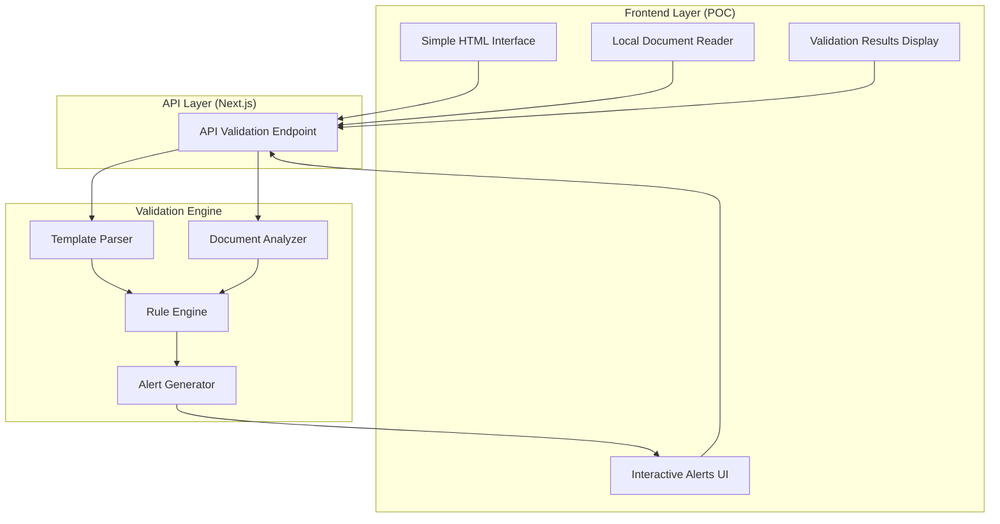

# Design Document: Gap Analysis Completeness Check

## Overview

The Gap Analysis Completeness Check is a simplified proof-of-concept feature that validates local documents against Excel or JSON templates. This solution uses a simple HTML frontend with a Next.js API backend validation engine. The system reads local documents, validates them against template requirements, and provides interactive feedback through alerts - no database or file upload complexity.

The design focuses on core validation functionality with minimal infrastructure requirements for rapid prototyping and concept validation.

## Architecture

### High-Level Architecture



### Technology Integration

This simplified design focuses on core validation functionality:
- **Frontend**: Simple HTML/CSS/JavaScript (no React complexity)
- **Backend**: Single Next.js API route for validation
- **Document Processing**: Local file reading with existing libraries (pdf-lib, mammoth)
- **Template Parsing**: Excel/JSON parsing without database storage
- **No Database**: All processing in-memory for POC simplicity

## Components and Interfaces

### 1. Template Parser

**Purpose**: Parses Excel and JSON templates to extract validation rules (in-memory processing)

**Key Methods**:
```typescript
interface TemplateParser {
  parseExcelTemplate(fileContent: Buffer): ValidationRuleSet
  parseJsonTemplate(fileContent: string): ValidationRuleSet
  extractValidationRules(template: any): ValidationRule[]
}
```

**Responsibilities**:
- Parse Excel files using existing document processing libraries
- Parse JSON template files with structured validation rules
- Extract validation criteria and requirements (no validation of template itself)

### 2. Document Analyzer

**Purpose**: Analyzes local documents against template requirements

**Key Methods**:
```typescript
interface DocumentAnalyzer {
  analyzeLocalDocument(fileContent: Buffer, template: ValidationRuleSet): AnalysisResult
  checkContentPresence(document: any, rules: ValidationRule[]): ContentCheck[]
  validateFormatRequirements(document: any, rules: ValidationRule[]): FormatCheck[]
  generateGapReport(checks: ValidationCheck[]): GapReport
}
```

**Responsibilities**:
- Process local documents using existing parsing libraries
- Check content presence against template requirements
- Validate document format requirements
- Generate detailed gap analysis reports (in-memory)

### 3. Rule Engine

**Purpose**: Executes validation rules against document content (stateless processing)

**Key Methods**:
```typescript
interface RuleEngine {
  executeRule(rule: ValidationRule, document: any): RuleResult
  evaluateConditions(conditions: RuleCondition[], content: any): boolean
  calculateCompleteness(results: RuleResult[]): CompletenessScore
  prioritizeIssues(results: RuleResult[]): PrioritizedIssue[]
}
```

**Responsibilities**:
- Execute individual validation rules
- Evaluate rule conditions against document content
- Calculate overall completeness scores
- Prioritize issues by severity and impact

### 4. Alert Generator

**Purpose**: Creates interactive alerts and remediation suggestions (client-side display)

**Key Methods**:
```typescript
interface AlertGenerator {
  generateAlerts(gaps: ValidationGap[]): InteractiveAlert[]
  createRemediationSteps(gap: ValidationGap): RemediationStep[]
  formatAlertMessage(alert: InteractiveAlert): AlertMessage
  createInteractiveElements(alerts: InteractiveAlert[]): HTMLElement[]
}
```

**Responsibilities**:
- Generate user-friendly alert messages
- Create actionable remediation steps
- Format alerts for HTML display
- Create interactive DOM elements for alerts

## Data Models

### ValidationRuleSet

```typescript
interface ValidationRuleSet {
  name: string
  templateType: 'excel' | 'json'
  rules: ValidationRule[]
}

interface ValidationRule {
  name: string
  description: string
  type: 'content_presence' | 'format_requirement'
  field: string
  required: boolean
  severity: 'critical' | 'warning' | 'info'
  remediationHint: string
}
```

### AnalysisResult

```typescript
interface AnalysisResult {
  documentName: string
  templateName: string
  completenessPercentage: number
  gaps: ValidationGap[]
  alerts: InteractiveAlert[]
  analysisDate: Date
  processingTime: number
}
}

interface ValidationGap {
  ruleId: string
  severity: 'critical' | 'warning' | 'info'
  category: 'missing_content' | 'format_error'
  description: string
  remediationSteps: string[]
  required: boolean
}

interface InteractiveAlert {
  gapId: string
  title: string
  message: string
  remediationSteps: string[]
  status: 'open' | 'acknowledged' | 'resolved'
  acknowledgedAt?: Date
  resolvedAt?: Date
}
```

Now I need to use the prework tool to analyze the acceptance criteria before writing the correctness properties.

<function_calls>
<invoke name="prework">
<parameter name="featureName">gap-analysis-completeness-check

## Correctness Properties

*A property is a characteristic or behavior that should hold true across all valid executions of a system-essentially, a formal statement about what the system should do. Properties serve as the bridge between human-readable specifications and machine-verifiable correctness guarantees.*

### Property 1: Template Parsing Completeness
*For any* valid template file (Excel or JSON), parsing should successfully extract all validation rules defined in the template structure
**Validates: Requirements 1.1, 3.1**

### Property 2: Document Validation Accuracy
*For any* document and template combination, validation should correctly identify all gaps and calculate accurate completeness percentage
**Validates: Requirements 1.2, 1.5**

### Property 3: Gap Detection Precision
*For any* document with missing required content, the system should identify and flag all specific gaps with correct severity and required status
**Validates: Requirements 1.3**

### Property 4: Completeness Recognition
*For any* document containing all required elements, the system should mark it as complete with appropriate success indicators
**Validates: Requirements 1.4**

### Property 5: Interactive Alert Generation
*For any* identified gap, the system should display interactive alerts with specific descriptions and remediation actions
**Validates: Requirements 2.1, 2.2, 2.3**

### Property 6: Alert Lifecycle Management
*For any* alert, the system should correctly track acknowledgment and resolution status during user interactions
**Validates: Requirements 2.4, 2.5**

### Property 7: Template Format Support
*For any* valid Excel or JSON template format, the system should correctly parse validation criteria from the file structure
**Validates: Requirements 3.2, 3.3**

### Property 8: Template Selection Functionality
*For any* collection of available templates, users should be able to select templates and have validation use the correct selected template
**Validates: Requirements 3.4**

## Error Handling

### Template Processing Errors

**Invalid Template Structure**:
- Malformed Excel files: Display specific parsing errors with cell references
- Invalid JSON syntax: Show JSON validation errors with location details
- Missing required template fields: List all missing required elements
- Unsupported template versions: Provide version compatibility information

**Template Rule Validation Errors**:
- Conflicting rules: Identify and display rule conflicts with resolution suggestions
- Invalid rule syntax: Show specific syntax errors with correction hints
- Missing rule parameters: List required parameters for each rule type

### Document Processing Errors

**Local File Reading Errors**:
- Unsupported file formats: Display supported format list
- File access permissions: Show file permission requirements
- Corrupted files: Provide file repair suggestions
- File size limitations: Show current limits and suggest optimization

**Document Analysis Errors**:
- Parsing failures: Log specific parsing errors and suggest document format fixes
- Content extraction issues: Provide fallback extraction methods
- Memory limitations: Implement streaming processing for large documents
- Processing timeouts: Show progress and allow extended processing time

### Validation Engine Errors

**Rule Execution Errors**:
- Rule processing failures: Log rule-specific errors and continue with remaining rules
- Performance timeouts: Implement incremental validation with progress tracking
- Resource exhaustion: Graceful degradation with partial results
- Memory allocation issues: Optimize processing for large documents

### User Interface Errors

**Alert Display Errors**:
- Rendering failures: Fallback to text-based alert display
- Interactive element failures: Provide alternative navigation methods
- Browser compatibility issues: Progressive enhancement for older browsers
- JavaScript execution errors: Graceful degradation to basic functionality

## Testing Strategy

### Dual Testing Approach

The Gap Analysis Completeness Check will use both unit testing and property-based testing to ensure comprehensive coverage:

**Unit Tests**: Focus on specific examples, edge cases, and error conditions
- Test specific template parsing with known Excel and JSON files
- Verify error handling for corrupted or invalid files
- Test integration between HTML frontend and Next.js API endpoint
- Validate specific alert formats and user interactions
- Test local file reading and processing workflows

**Property Tests**: Verify universal properties across all inputs using fast-check library
- Generate random template files (Excel/JSON) to test parsing completeness
- Test validation accuracy with randomly generated document-template combinations
- Verify alert generation with random gap scenarios
- Test error handling with random invalid template structures
- Verify rule execution with random rule combinations

### Property-Based Testing Configuration

- **Library**: fast-check (JavaScript/TypeScript property testing library)
- **Minimum iterations**: 100 per property test
- **Test tagging**: Each property test references its design document property
- **Tag format**: **Feature: gap-analysis-completeness-check, Property {number}: {property_text}**

### Testing Coverage Requirements

**Unit Testing Focus Areas**:
- Template parser integration with existing document processing libraries
- Next.js API endpoint functionality and error responses
- HTML frontend interaction with backend API
- Local file reading and processing workflows
- Alert generation and display logic
- In-memory data processing and validation

**Property Testing Focus Areas**:
- Universal template parsing behavior across all valid template formats
- Validation accuracy across all document-template combinations
- Alert lifecycle management for all gap scenarios
- Error handling consistency across all failure modes
- Rule execution behavior across all rule types

Both testing approaches are essential for ensuring the system works correctly across the wide variety of templates, documents, and usage patterns expected in document validation environments.

### Integration with Existing Infrastructure

**Leveraging Current Testing Setup**:
- Extend existing Jest/testing framework used in the IND Manager
- Integrate with current CI/CD pipeline for automated testing
- Reuse existing document processing test utilities
- Build upon current API testing patterns and mocks
- Utilize existing TypeScript testing configurations