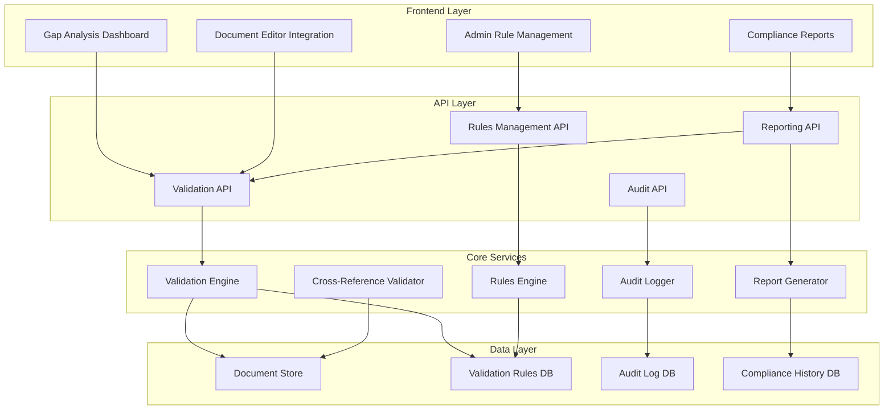

# Design Document: Gap Analysis Design Proposal

## Overview

The Completeness Check Enhancement extends the existing IND Manager gap analysis system with automated validation capabilities focused on document completeness, compliance reporting, and cross-reference validation. The system provides comprehensive validation against FDA requirements while integrating seamlessly with the existing document management workflow.

The design builds upon the existing gap analysis dashboard and module status tracking, adding a validation engine that can automatically assess document completeness, generate compliance reports, and maintain audit trails for regulatory compliance.

## Glossary

- **System**: The IND Manager completeness check enhancement system
- **Document**: Any file or section within an IND submission module
- **Completeness_Rule**: A validation rule that defines what constitutes a complete document or section
- **Compliance_Report**: A detailed report showing completeness status and specific gaps
- **Validation_Engine**: The core system component that executes completeness checks
- **FDA_Requirements**: Official FDA guidelines and requirements for IND submissions
- **Module**: One of the five CTD modules (Administrative, CTD Summaries, Quality, Nonclinical, Clinical)
- **Section**: A specific subsection within a module (e.g., Form FDA 1571, Toxicology Summary)

## Requirements 

## Requirements

The IND Manager application currently provides gap analysis functionality for tracking IND submission readiness. This feature enhancement will add comprehensive completeness checking capabilities to automatically validate document completeness, cross-reference requirements, and provide detailed compliance reporting for FDA IND submissions.

The requirements are prioritized in order.

### Requirement 1: Automated Document Completeness Validation

**User Story:** As a regulatory affairs specialist, I want the system to automatically validate document completeness against FDA requirements, so that I can identify missing or incomplete sections before submission.

#### Acceptance Criteria

1. WHEN a completeness check is initiated, THE System SHALL validate one or all documents against predefined FDA requirements
2. WHEN a document is missing required content, THE System SHALL flag it as incomplete with specific details
3. WHEN a document contains all required elements, THE System SHALL mark it as complete
4. THE System SHALL validate document format requirements (PDF, page limits, signatures)

### Requirement 2: Detailed Compliance Reporting

**User Story:** As a regulatory affairs manager, I want comprehensive compliance reports, so that I can demonstrate submission readiness to stakeholders and FDA.

#### Acceptance Criteria

1. WHEN a compliance report is requested, THE System SHALL generate a detailed completeness assessment
2. WHEN generating reports, THE System SHALL include specific gap descriptions and remediation steps
3. WHEN reports are exported, THE System SHALL support multiple formats (PDF, Excel, Word)
4. THE System SHALL track completeness history and show progress over time
5. WHEN audit trails are needed, THE System SHALL provide complete validation history with timestamps

### Requirement 3: Cross-Reference Validation

**User Story:** As a regulatory affairs specialist, I want the system to validate cross-references between documents, so that I can ensure consistency across the entire submission.

#### Acceptance Criteria

1. WHEN documents reference other sections, THE System SHALL verify that referenced content exists
2. WHEN cross-referenced data is inconsistent, THE System SHALL flag discrepancies with specific locations
3. WHEN a referenced document is updated, THE System SHALL check all dependent documents for impact
4. THE System SHALL validate that all required cross-references are present and accurate
5. WHEN pagination changes occur, THE System SHALL update all table of contents references automatically


### Requirement 4: Integration with Document Management

**User Story:** As a document author, I want the completeness checker to integrate with the document editor, so that I can see validation results while working on documents.

#### Acceptance Criteria

1. WHEN editing documents, THE System SHALL show real-time completeness status in the editor
2. WHEN validation errors exist, THE System SHALL highlight specific sections needing attention
3. WHEN documents are saved, THE System SHALL automatically trigger completeness validation
4. THE System SHALL provide inline suggestions for resolving completeness issues
5. WHEN templates are used, THE System SHALL pre-populate required sections and validate completion

### Requirement 5: Configurable Validation Rules

**User Story:** As a system administrator, I want to configure validation rules, so that I can adapt the system to different submission types and regulatory requirements.

#### Acceptance Criteria

1. WHEN new FDA guidelines are released, THE System SHALL allow administrators to update validation rules
2. WHEN different submission types are used, THE System SHALL support multiple rule sets
3. WHEN custom requirements exist, THE System SHALL allow creation of organization-specific rules
4. THE System SHALL validate rule configurations before activation
5. WHEN rules conflict, THE System SHALL prevent activation and show specific conflicts

### Requirement 6: Audit Trail and Version Control

**User Story:** As a quality assurance manager, I want complete audit trails of completeness checks, so that I can demonstrate compliance with validation procedures.

#### Acceptance Criteria

1. WHEN completeness checks are performed, THE System SHALL log all validation activities with timestamps
2. WHEN validation results change, THE System SHALL maintain history of previous states
3. WHEN users acknowledge issues, THE System SHALL record acknowledgment details and user identity
4. THE System SHALL track who performed each validation and when
5. WHEN audit reports are needed, THE System SHALL generate comprehensive validation history reports

## Architecture

### High-Level Architecture



### Component Integration

The enhancement integrates with existing components:
- **Gap Analysis Dashboard**: Extended with automated validation results
- **Module Status Cards**: Enhanced with detailed completeness metrics
- **Document Editor**: Integrated with real-time validation feedback
- **Issue Tracking**: Expanded with automated issue detection

## Components and Interfaces

### 1. Validation Engine

**Purpose**: Core component that executes document completeness validation

**Key Methods**:
```typescript
interface ValidationEngine {
  validateDocument(documentId: string, ruleSetId: string): ValidationResult
  validateModule(moduleId: string): ModuleValidationResult
  validateSubmission(submissionId: string): SubmissionValidationResult
  getValidationStatus(documentId: string): ValidationStatus
}
```

**Responsibilities**:
- Execute validation rules against documents
- Assess document completeness against FDA requirements
- Generate validation results with specific gap details
- Support both single document and batch validation

### 2. Rules Engine

**Purpose**: Manages configurable validation rules for different submission types

**Key Methods**:
```typescript
interface RulesEngine {
  loadRuleSet(submissionType: string): ValidationRuleSet
  createRule(rule: ValidationRule): RuleCreationResult
  updateRule(ruleId: string, rule: ValidationRule): RuleUpdateResult
  validateRuleConfiguration(rule: ValidationRule): RuleValidationResult
  detectRuleConflicts(rules: ValidationRule[]): ConflictReport
}
```

**Responsibilities**:
- Load and manage validation rules
- Support multiple rule sets for different submission types
- Validate rule syntax and detect conflicts
- Enable custom organizational rules

### 3. Cross-Reference Validator

**Purpose**: Validates consistency and accuracy of cross-references between documents

**Key Methods**:
```typescript
interface CrossReferenceValidator {
  validateReferences(documentId: string): ReferenceValidationResult
  checkDependencies(documentId: string): DependencyCheckResult
  updateReferences(documentId: string, changes: DocumentChange[]): void
  validateReferenceCompleteness(submissionId: string): ReferenceCompletenessResult
}
```

**Responsibilities**:
- Track and validate document cross-references
- Detect inconsistencies in referenced data
- Update references when documents change
- Ensure all required cross-references are present

### 4. Report Generator

**Purpose**: Generates comprehensive compliance and audit reports

**Key Methods**:
```typescript
interface ReportGenerator {
  generateComplianceReport(submissionId: string, format: ReportFormat): ComplianceReport
  generateAuditReport(submissionId: string, dateRange: DateRange): AuditReport
  exportReport(reportId: string, format: ExportFormat): ExportResult
  getCompletenessHistory(submissionId: string): CompletenessHistory
}
```

**Responsibilities**:
- Generate detailed compliance assessments
- Support multiple export formats (PDF, Excel, Word)
- Track completeness history and progress
- Create audit trails for regulatory compliance

### 5. Audit Logger

**Purpose**: Maintains comprehensive audit trails of all validation activities

**Key Methods**:
```typescript
interface AuditLogger {
  logValidationActivity(activity: ValidationActivity): void
  logUserAcknowledgment(acknowledgment: UserAcknowledgment): void
  getValidationHistory(documentId: string): ValidationHistory
  generateAuditTrail(submissionId: string, filters: AuditFilters): AuditTrail
}
```

**Responsibilities**:
- Log all validation activities with timestamps
- Track user acknowledgments and actions
- Maintain validation history
- Generate comprehensive audit trails

## Data Models

### ValidationResult

```typescript
interface ValidationResult {
  documentId: string
  ruleSetId: string
  status: 'complete' | 'incomplete' | 'warning' | 'error'
  completenessPercentage: number
  gaps: ValidationGap[]
  formatIssues: FormatIssue[]
  lastValidated: Date
  validatedBy: string
}

interface ValidationGap {
  id: string
  severity: 'critical' | 'warning' | 'info'
  category: 'missing_content' | 'incomplete_section' | 'format_error'
  description: string
  location: DocumentLocation
  remediationSteps: string[]
  ruleId: string
}
```

### ValidationRule

```typescript
interface ValidationRule {
  id: string
  name: string
  description: string
  submissionTypes: string[]
  category: 'content' | 'format' | 'cross_reference'
  conditions: RuleCondition[]
  severity: 'critical' | 'warning' | 'info'
  active: boolean
  customRule: boolean
  createdBy: string
  createdAt: Date
}

interface RuleCondition {
  field: string
  operator: 'required' | 'format_match' | 'length_min' | 'length_max' | 'exists'
  value: any
  errorMessage: string
}
```

### ComplianceReport

```typescript
interface ComplianceReport {
  id: string
  submissionId: string
  generatedAt: Date
  generatedBy: string
  overallCompleteness: number
  moduleAssessments: ModuleAssessment[]
  criticalGaps: ValidationGap[]
  recommendations: string[]
  auditSummary: AuditSummary
}

interface ModuleAssessment {
  moduleId: string
  moduleName: string
  completeness: number
  sectionsComplete: number
  sectionsTotal: number
  gaps: ValidationGap[]
  crossReferenceStatus: CrossReferenceStatus
}
```

### CrossReferenceValidation

```typescript
interface CrossReferenceValidation {
  documentId: string
  references: DocumentReference[]
  brokenReferences: BrokenReference[]
  inconsistencies: DataInconsistency[]
  lastChecked: Date
}

interface DocumentReference {
  sourceLocation: DocumentLocation
  targetDocumentId: string
  targetLocation: DocumentLocation
  referenceType: 'page' | 'section' | 'table' | 'figure'
  isValid: boolean
}
```


## Error Handling

### Validation Engine Error Handling

**Rule Execution Errors**:
- Invalid rule syntax: Log error, disable rule, notify administrators
- Missing rule dependencies: Mark validation as incomplete, identify missing rules
- Rule timeout: Cancel execution, log timeout, provide partial results

**Document Processing Errors**:
- Corrupted documents: Flag as unprocessable, notify document owner
- Missing documents: Mark as validation gap, suggest document creation
- Access permission errors: Log security event, notify administrators

**Cross-Reference Validation Errors**:
- Circular references: Detect cycles, report as validation issue
- Broken references: Mark as validation error, suggest corrections
- Inconsistent data: Flag discrepancies, provide comparison details

### System Integration Error Handling

**Database Connection Failures**:
- Implement connection pooling and retry logic
- Cache validation results locally during outages
- Graceful degradation to read-only mode

**Report Generation Errors**:
- Handle export format failures gracefully
- Provide alternative formats when primary format fails
- Log generation errors for troubleshooting

**Audit Trail Integrity**:
- Ensure audit logs are never lost due to system failures
- Implement backup logging mechanisms
- Validate audit log completeness regularly

## Testing Strategy

### Dual Testing Approach

The completeness check enhancement will use both unit testing and property-based testing to ensure comprehensive coverage:

**Unit Tests**: Focus on specific examples, edge cases, and error conditions
- Test specific validation rules with known documents
- Verify error handling for corrupted files
- Test integration points between components
- Validate specific report formats and content
- Test cross-reference validation with known document structures

**Property Tests**: Verify universal properties across all inputs using fast-check library
- Generate random documents and rule sets to test validation completeness
- Test cross-reference validation with randomly generated document structures
- Verify audit logging with random user actions and system events
- Test rule conflict detection across random rule combinations


### Testing Coverage Requirements

**Unit Testing Focus Areas**:
- Validation rule parsing and execution
- Document format validation (PDF, signatures, page limits)
- Report generation in multiple formats
- Cross-reference tracking and validation
- Audit trail generation and integrity
- Integration with existing gap analysis components

**Integ Testing Focus Areas**:
- Universal validation behavior across all document types
- Cross-reference consistency across random document structures
- Audit trail completeness for all system activities
- Rule conflict detection across random rule combinations
- Report generation consistency across different data sets

Both testing approaches are essential for ensuring the system works correctly across the wide variety of documents, rules, and usage patterns expected in FDA submission environments.

## # Implementation Plan: Completeness Check Enhancement

This implementation plan extends the existing IND Manager gap analysis system with automated validation capabilities using Python. The tasks build incrementally on the existing codebase, integrating new completeness checking functionality with the current gap analysis dashboard and module status tracking.

### Tasks Roadmap

- [ ] 1. Set up Python validation service infrastructure
  - Create Python FastAPI service for validation engine
  - Set up SQLAlchemy models for validation rules and audit logs
  - Configure Redis caching for validation results
  - Create API endpoints structure and authentication
  - _Requirements: 1.1, 5.4, 6.1_

- [ ] 1.1 Write unit tests for validation service setup
  - Test API endpoint authentication and basic connectivity
  - Test database models and migrations
  - _Requirements: 1.1, 5.4, 6.1_

- [ ] 2. Implement core validation engine
  - [ ] 2.1 Create ValidationEngine class in Python
    - Implement document validation against rule sets using Pydantic models
    - Add support for different validation rule types (content, format, cross-reference)
    - Create validation result aggregation and scoring logic
    - _Requirements: 1.1, 1.2, 1.3_

  - [ ] 2.2 Write unit tests for validation engine
    - Test rule execution with sample documents
    - Test validation result aggregation
    - Test error handling for invalid documents
    - _Requirements: 1.1, 1.2, 1.3_

  - [ ] 2.3 Implement RulesEngine class for configurable validation
    - Create rule loading and management using SQLAlchemy
    - Add rule syntax validation using JSON schema
    - Implement rule conflict detection algorithms
    - Support multiple rule sets for different submission types
    - _Requirements: 5.1, 5.2, 5.3, 5.4, 5.5_

  - [ ] 2.4 Write unit tests for rules engine
    - Test rule loading and validation
    - Test conflict detection with sample rule sets
    - Test rule set management for different submission types
    - _Requirements: 5.1, 5.2, 5.3, 5.4, 5.5_

- [ ] 3. Implement document format validation
  - [ ] 3.1 Create DocumentFormatValidator class
    - Implement PDF validation using PyPDF2 or pdfplumber
    - Add page limit checking and signature detection
    - Create file format validation (PDF, Word, Excel)
    - _Requirements: 1.4_

  - [ ] 3.2 Write unit tests for format validation
    - Test PDF validation with sample documents
    - Test page limit and signature detection
    - Test various file format validations
    - _Requirements: 1.4_

- [ ] 4. Implement cross-reference validation system
  - [ ] 4.1 Create CrossReferenceValidator class
    - Implement document reference tracking using networkx
    - Add cross-reference consistency checking algorithms
    - Create dependency impact analysis
    - _Requirements: 3.1, 3.2, 3.3, 3.4_

  - [ ] 4.2 Write unit tests for cross-reference validation
    - Test reference tracking with sample document structures
    - Test consistency checking algorithms
    - Test dependency impact analysis
    - _Requirements: 3.1, 3.2, 3.3, 3.4_

  - [ ] 4.3 Implement automatic reference updates
    - Add pagination change detection using document parsing
    - Create table of contents update algorithms
    - Implement reference map generation and maintenance
    - _Requirements: 3.5_

  - [ ] 4.4 Write unit tests for automatic reference updates
    - Test pagination change detection
    - Test TOC update algorithms
    - Test reference map generation
    - _Requirements: 3.5_

- [ ] 5. Checkpoint - Ensure core validation tests pass
  - Ensure all tests pass, ask the user if questions arise.

- [ ] 6. Implement compliance reporting system
  - [ ] 6.1 Create ComplianceReporter class
    - Implement comprehensive report generation using Jinja2 templates
    - Add support for multiple export formats using reportlab (PDF), openpyxl (Excel), python-docx (Word)
    - Create historical data tracking using SQLAlchemy
    - Implement progress visualization using matplotlib
    - _Requirements: 2.1, 2.2, 2.3, 2.4_

  - [ ] 6.2 Write unit tests for compliance reporting
    - Test report generation with sample data
    - Test multiple export formats
    - Test historical data tracking and progress visualization
    - _Requirements: 2.1, 2.2, 2.3, 2.4_

  - [ ] 6.3 Implement audit trail system
    - Create comprehensive audit logging using Python logging and SQLAlchemy
    - Add audit report generation with filtering and search
    - Integrate with existing authentication system for user tracking
    - _Requirements: 2.5, 6.1, 6.2, 6.3, 6.4, 6.5_

  - [ ] 6.4 Write unit tests for audit system
    - Test audit logging functionality
    - Test audit report generation and filtering
    - Test user tracking integration
    - _Requirements: 2.5, 6.1, 6.2, 6.3, 6.4, 6.5_

- [ ] 7. Create API endpoints for frontend integration
  - [ ] 7.1 Implement validation API endpoints
    - Create FastAPI endpoints for document validation
    - Add endpoints for rule management (CRUD operations)
    - Implement report generation and export APIs
    - Add WebSocket support for real-time validation updates
    - _Requirements: 1.1, 2.1, 5.1_

  - [ ] 7.2 Write API integration tests
    - Test all validation API endpoints with sample data
    - Test rule management endpoints
    - Test report generation and export functionality
    - Test WebSocket real-time updates
    - _Requirements: 1.1, 2.1, 5.1_

- [ ] 8. Integrate with document editor (TypeScript frontend)
  - [ ] 8.1 Extend section editor with validation integration
    - Add real-time completeness status display using API calls
    - Implement inline error highlighting in the editor
    - Create automatic validation triggering on document save
    - Add inline suggestions for resolving completeness issues
    - _Requirements: 4.1, 4.2, 4.3, 4.4_

  - [ ] 8.2 Write frontend integration tests
    - Test real-time validation status updates
    - Test inline error highlighting functionality
    - Test automatic validation triggering
    - Test inline suggestion display
    - _Requirements: 4.1, 4.2, 4.3, 4.4_

  - [ ] 8.3 Implement template validation support
    - Add template-based document validation in Python backend
    - Create pre-population of required sections via API
    - Integrate with existing template system
    - _Requirements: 4.5_

  - [ ] 8.4 Write unit tests for template validation
    - Test template-based validation logic
    - Test section pre-population functionality
    - Test integration with template system
    - _Requirements: 4.5_

- [ ] 9. Update existing gap analysis components (TypeScript)
  - [ ] 9.1 Enhance gap analysis dashboard
    - Integrate Python validation API results into existing dashboard
    - Add completeness check controls and status displays
    - Update module status cards with detailed validation info from API
    - Replace mock data with real validation results
    - _Requirements: 1.1, 1.2, 1.3_

  - [ ] 9.2 Extend recent issues table
    - Add automated validation issues from Python API to existing issue tracking
    - Integrate with new issue detection and categorization
    - Update issue detail dialogs with validation context from API
    - _Requirements: 1.2, 2.1_

  - [ ] 9.3 Write integration tests for enhanced components
    - Test integration between Python validation API and TypeScript UI
    - Verify data flow from validation engine to dashboard
    - Test real-time updates and error handling
    - _Requirements: 1.1, 1.2, 2.1_

- [ ] 10. Implement background processing and caching
  - [ ] 10.1 Create background validation processing
    - Implement Celery task queue for validation jobs
    - Add incremental validation for changed documents only
    - Create validation result caching using Redis
    - Implement job status tracking and progress updates
    - _Requirements: 1.1, 1.3_

  - [ ] 10.2 Write tests for background processing
    - Test Celery task execution and job queuing
    - Test incremental validation logic
    - Test caching functionality and cache invalidation
    - Test job status tracking
    - _Requirements: 1.1, 1.3_

- [ ] 11. Add comprehensive error handling and recovery
  - [ ] 11.1 Implement error handling across Python services
    - Add validation engine error recovery and graceful degradation
    - Create database connection failure handling
    - Implement API error responses and logging
    - Add retry logic for transient failures
    - _Requirements: 1.1, 2.1_

  - [ ] 11.2 Write error handling tests
    - Test error recovery scenarios
    - Test graceful degradation behavior
    - Test API error responses
    - Test retry logic functionality
    - _Requirements: 1.1, 2.1_

- [ ] 12. Deploy and configure Python services
  - [ ] 12.1 Set up Python service deployment
    - Configure Docker containers for Python validation service
    - Set up database migrations and initial rule data
    - Configure Redis for caching and Celery for background jobs
    - Set up monitoring and logging for Python services
    - _Requirements: All requirements_

  - [ ] 12.2 Write deployment and configuration tests
    - Test Docker container deployment
    - Test database migrations and data seeding
    - Test service connectivity and health checks
    - _Requirements: All requirements_

- [ ] 13. Final integration and testing
  - [ ] 13.1 Wire all components together
    - Connect Python validation engine to TypeScript dashboard updates
    - Integrate notification system with validation results
    - Link compliance reporting with audit trail system
    - Test end-to-end workflow from document upload to report generation
    - _Requirements: All requirements_

  - [ ] 13.2 Write end-to-end integration tests
    - Test complete validation workflow from document upload to report generation
    - Verify real-time updates and notifications work correctly
    - Test cross-service communication and error handling
    - _Requirements: All requirements_

- [ ] 14. Final checkpoint - Ensure all tests pass
  - Ensure all tests pass, ask the user if questions arise.

## Notes

- Each task references specific requirements for traceability
- Python backend handles validation logic, reporting, and data processing
- TypeScript frontend integrates with Python APIs for real-time validation
- The implementation builds incrementally on existing gap analysis functionality
- Background processing with Celery ensures UI responsiveness during validation operations
- Redis caching improves performance for repeated validations

## Python Technology Stack

- **FastAPI**: REST API framework for validation endpoints
- **SQLAlchemy**: ORM for database operations and rule management
- **Pydantic**: Data validation and serialization
- **Celery**: Background task processing for validation jobs
- **Redis**: Caching validation results and Celery message broker
- **PyPDF2/pdfplumber**: PDF document processing and validation
- **reportlab**: PDF report generation
- **openpyxl**: Excel report generation
- **python-docx**: Word document report generation
- **Jinja2**: Template engine for report generation
- **networkx**: Graph algorithms for cross-reference analysis
- **matplotlib**: Progress visualization and charts
- **pytest**: Unit and integration testing